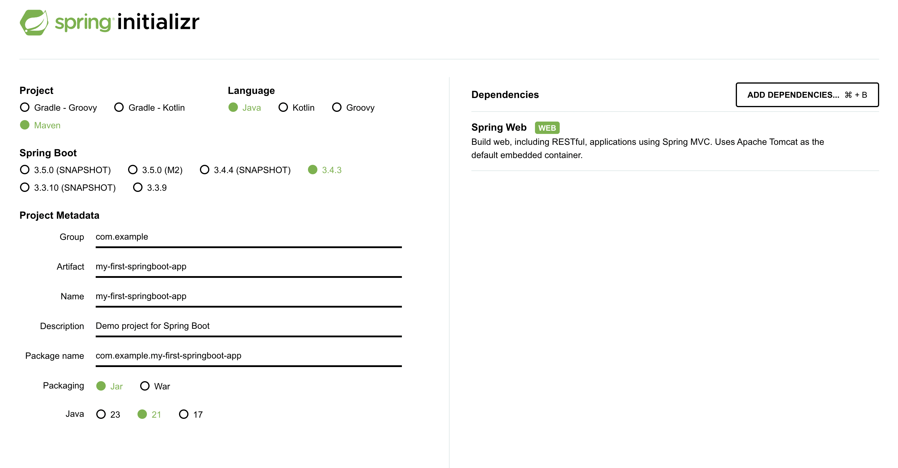
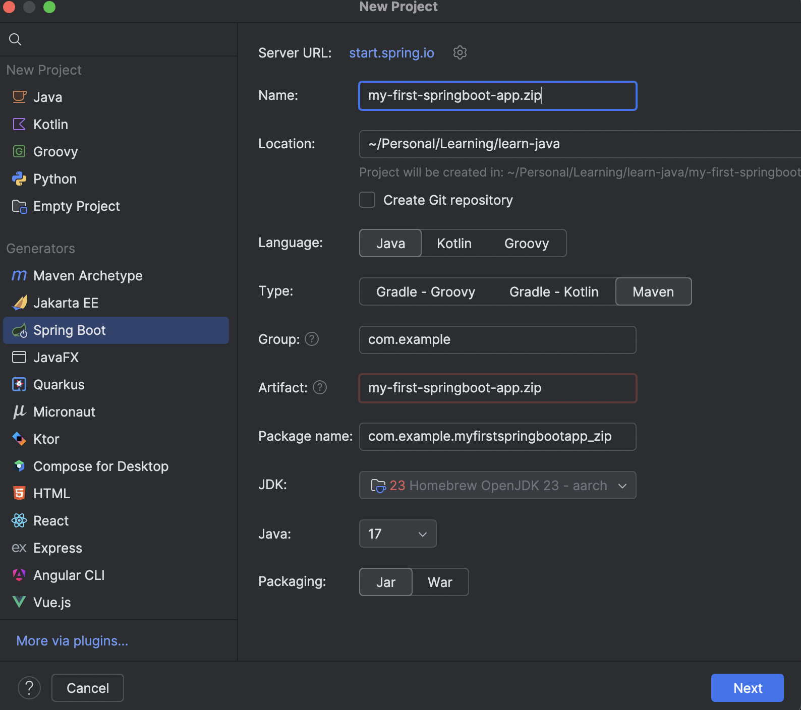
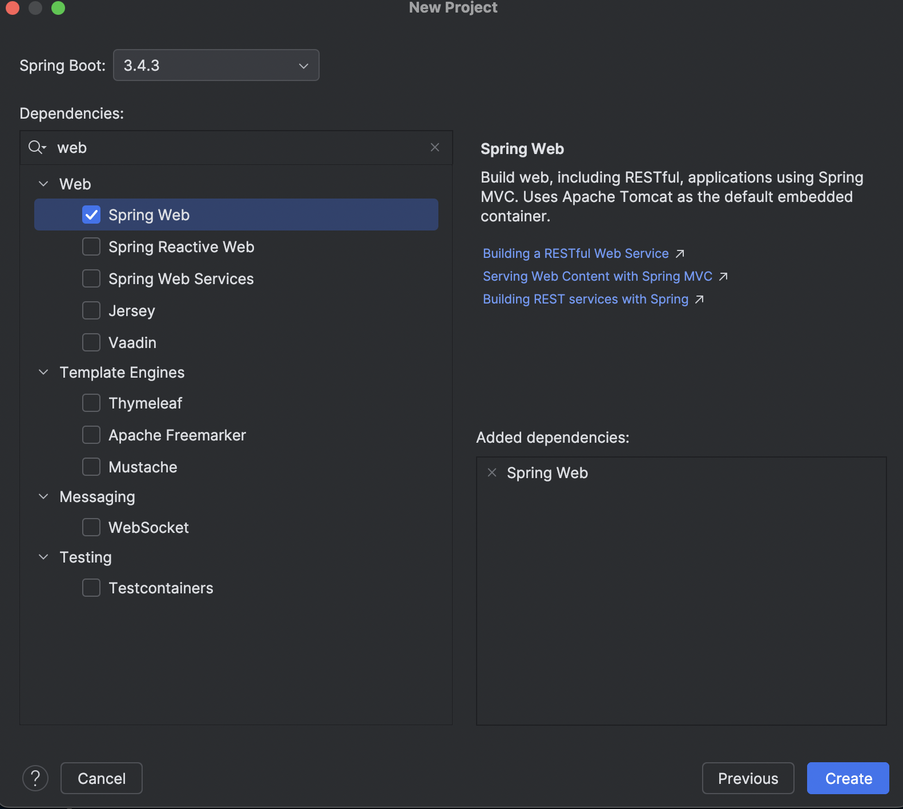

# Introduction to Spring Boot & Project Setup

Let's move on to Spring Boot!  It might sound a bit fancy, but it's actually a tool that makes building Java applications, especially web applications, much easier and faster.

**What is Spring Boot?**

Imagine you want to build a house with LEGO bricks.  You *could* start from scratch with individual bricks, figuring out how everything connects. But it would be much faster and easier if you had pre-made sets or modules for common parts of the house, like walls, windows, and doors.

Spring Boot is like those pre-made sets for Java web applications. It provides a lot of things already set up and configured for you, so you don't have to do everything from the beginning.  It helps you build applications quickly and easily!

**Why use Spring Boot?**

* **Makes Java Web Development Easier:**  It handles a lot of the complicated setup for you.
* **Fast Development:** You can build applications much faster than with traditional Java methods.
* **Less Configuration:**  It comes with sensible defaults and reduces the amount of configuration you need to write.
* **Popular and Widely Used:** Many companies use Spring Boot for building their web applications and services.

**Creating Your First Spring Boot Project**

We'll use a tool called **Spring Initializr** to create a basic Spring Boot project. It's like a project generator that sets up the foundation for you.

1. **Go to Spring Initializr Website:**
   - Open your web browser and go to: [https://start.spring.io/](https://start.spring.io/)

2. **Configure Your Project:**
   - You'll see a form with different options. Let's set them up like this:
     * **Project:**  Make sure **Maven Project** is selected (Maven helps manage your project's dependencies and build process).
     * **Language:** Choose **Java**.
     * **Spring Boot:** Select the latest **Stable** version (it will usually be pre-selected).
     * **Group:**  Enter `com.example` (This is like a package name for your project, usually based on your domain or organization - for now, `com.example` is fine).
     * **Artifact:** Enter `my-first-springboot-app` (This is the name of your application).
     * **Packaging:** Choose **Jar** (This creates a runnable Java archive file).
     * **Java:** Choose **21** or later (make sure it matches the JDK you have installed).

3. **Add Dependencies:**
   - Dependencies are like extra libraries or tools that your project needs. We want to build a web application, so we need the "Spring Web" dependency.
   - Click on the "Add dependencies..." button or link (it might say "Dependencies" and be a button to click).
   - In the search box that appears, type `Web`.
   - Select **"Spring Web"** (it should say "Web, RESTful API").  This will add the necessary components for building web applications in Spring Boot.

4. **Generate the Project:**
   - Once you've selected "Spring Web", click the **"GENERATE"** button (usually at the bottom of the page).
   - This will download a ZIP file named something like `my-first-springboot-app.zip`.
   

5. **Import into IntelliJ IDEA:**
   - Open IntelliJ IDEA.
   - Select `File` -> `Open...`
   - Navigate to the location where you downloaded the `my-first-springboot-app.zip` file.
   - **Important:**  **DO NOT unzip the file.** Select the ZIP file itself and click "Open".
   - IntelliJ IDEA will recognize it as a Maven project and import it.
   *Newer versions of Intellij allows you to create springboot project within the IDE without going to https://start.spring.io*
   Creating Spring Boot Project within IntelliJ
   
   Adding Dependencies:
   

6. **Explore the Project Structure (Briefly):**
   - In the Project window (usually on the left), you'll see the project structure:
     * **`pom.xml`**: This file describes your project, its dependencies (like Spring Web), and how to build it using Maven.
     * **`src/main/java`**: This is where your main Java code will go.
     * **`src/main/resources`**:  This is for configuration files and other resources (like your application's properties).

7. **Run Your Spring Boot Application:**
   - In the Project window, navigate to: `src` -> `main` -> `java` -> `com.example.myfirstspringbootapp` -> `MyFirstSpringbootAppApplication.java` (the name might be slightly different based on your Artifact name).
   - Right-click on the `MyFirstSpringbootAppApplication.java` file.
   - Select `Run 'MyFirstSpringbootAppApplication'`.
   - Look at the "Run" window in IntelliJ IDEA. You should see a lot of logs scrolling by.  Wait until you see something like:
     ```
     ... Started MyFirstSpringbootAppApplication in ... seconds (JVM running for ...)
     ```
     and
     ```
     ... Tomcat started on port(s): 8080 (http) with context path ''
     ```
     This means your Spring Boot application has started successfully!  It's now running and ready to accept web requests (though we haven't created any yet!).

**Congratulations! You've created and run your first Spring Boot project!** 🎉  It might not do much yet, but you've set up the foundation. In the next step, we'll make it do something useful – create a REST API!

---
